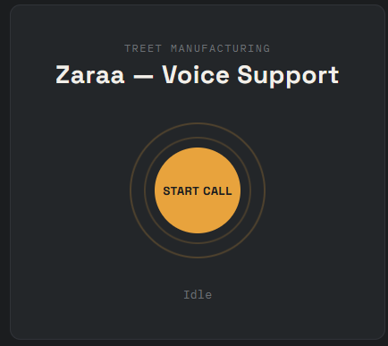

# Zaraa — Speech-to-Speech Voice Help Desk



A native speech-to-speech AI help desk agent for Treet Manufacturing, built on
Google's Gemini Live API. Unlike a traditional voice pipeline (speech-to-text
→ LLM → text-to-speech), Zaraa processes and generates audio natively —
speech goes in, speech comes out, with no intermediate text step exposed.

Talk to Zaraa naturally. She asks follow-up questions to understand your
issue, creates a structured support ticket once she has enough information,
and confirms it back to you — all in a real-time, interruptible voice
conversation.

## Features

- **Native speech-to-speech** — powered by Gemini's `gemini-3.1-flash-live-preview`
  model, not a chained STT/LLM/TTS pipeline
- **Real-time barge-in** — interrupt Zaraa mid-sentence and she stops
  immediately, just like a real phone conversation
- **Multilingual** — fluent in English, Urdu, and Punjabi, switching
  naturally mid-conversation based on what language you're speaking
- **Automatic ticket creation** — collects Main Category, Sub Category,
  Short Description, and Long Description through natural conversation,
  then creates a structured ticket via tool calling
- **Live status UI** — an animated control-panel interface that visibly
  reflects the conversation state (listening, speaking, ticket created)

## Architecture

```
┌─────────┐   WebSocket    ┌──────────────┐   WebSocket    ┌─────────────┐
│ Browser │ ─────────────► │  Node relay  │ ─────────────► │ Gemini Live │
│  (mic)  │ ◄───────────── │  (server.js) │ ◄───────────── │     API     │
└─────────┘   audio/JSON   └──────────────┘  audio/JSON    └─────────────┘
```

The browser never talks to Gemini directly. `server.js` acts as a relay:

1. It holds the real Gemini API key, so the browser never sees it.
2. It opens one outbound WebSocket connection to Gemini Live and one
   WebSocket *server* for the browser to connect to.
3. It forwards raw microphone audio from the browser to Gemini, and
   forwards Gemini's spoken responses back to the browser — plus a couple
   of JSON control messages (`interrupted`, `ticketCreated`) for things
   that aren't raw audio.

### Audio format

| Direction | Format |
|---|---|
| Browser → Gemini (input) | Raw 16-bit PCM, mono, 16kHz |
| Gemini → Browser (output) | Raw 16-bit PCM, mono, 24kHz |

Capturing and converting this raw audio is handled by a custom
[`AudioWorklet`](public/pcm-processor.js) running on a dedicated audio
thread in the browser. Playback is scheduled manually with the Web Audio
API so that streamed chunks play back-to-back with no gaps.

## Project structure

```
voice-live-poc/
├── server.js              # WebSocket relay + Gemini connection + tool-call handling
├── public/
│   ├── index.html          # UI: control-panel design, status ring, mic button
│   ├── app.js               # Mic capture, audio streaming, playback, interruption handling
│   └── pcm-processor.js     # AudioWorklet: converts mic audio to 16-bit PCM
├── .env.example
└── package.json
```

## Setup

**Requirements:** Node.js, a free [Google AI Studio](https://aistudio.google.com)
API key, a modern browser (Chrome/Firefox/Edge — not an embedded editor
preview, which doesn't support the required audio/WebSocket APIs).

```bash
npm install
cp .env.example .env
# paste your Gemini API key into .env
node server.js
```

Then open **`http://localhost:3001`** in a real browser tab and click
**Start Call**.

> For best interruption/barge-in behavior, use headphones. Without them,
> your microphone can pick up Zaraa's own voice from your speakers, which
> makes it harder for her to reliably detect when you're talking over her.

## How a conversation works

1. Click **Start Call** — the browser requests mic access and opens a
   WebSocket connection to the relay.
2. Your voice streams continuously to Gemini. Gemini's own voice-activity
   detection decides when you've stopped talking — there's no manual
   "stop recording" step.
3. Zaraa responds with streamed audio, played back gaplessly as it arrives.
4. If you start talking while she's still speaking, Gemini detects the
   interruption and signals the relay, which tells the browser to
   immediately stop all queued/playing audio.
5. Once Zaraa has all four ticket fields, she calls the `create_ticket`
   tool. The relay stores the ticket in memory and pushes a confirmation
   to the browser, which shows it in the status readout for a few seconds.

## Viewing created tickets

```
http://localhost:3001/tickets
```

Returns the full list of tickets created so far, as JSON.

> Tickets are stored in memory only and are lost when the server restarts.
> Swapping in a real database (e.g. SQLite) is a natural next step.

## Known limitations

- **Single browser connection** — the relay currently supports one active
  browser session at a time; a second connection overwrites the first.
- **No automatic reconnection** — if the WebSocket connection drops (network
  hiccup, server restart), the page does not automatically recover.
- **~10 minute session cap** — Gemini Live sessions have a default duration
  limit before requiring reconnection/session-handoff logic, which this
  project does not yet implement.
- **In-memory ticket storage** — see above.
- **Echo-sensitive interruption** — barge-in reliability depends heavily on
  whether the microphone picks up the speaker's own audio; headphones are
  recommended.

## Tech stack

- **Runtime:** Node.js, Express (static file serving + `/tickets` endpoint)
- **Realtime transport:** [`ws`](https://www.npmjs.com/package/ws) (WebSocket server + client)
- **AI:** [Gemini Live API](https://ai.google.dev/gemini-api/docs/live-api) (`gemini-3.1-flash-live-preview`)
- **Frontend:** Vanilla HTML/CSS/JS — no framework — using the native
  `AudioWorklet` and Web Audio API for real-time audio capture and playback

## Related project

This project is a companion to a more traditional pipeline-based voice
agent (`voice-helpdesk`), which uses a chained speech-to-text → LLM →
text-to-speech architecture via Groq instead of a native speech-to-speech
model. Comparing the two is a useful way to see the real tradeoffs — cost,
latency, complexity, and control — between the two approaches.
